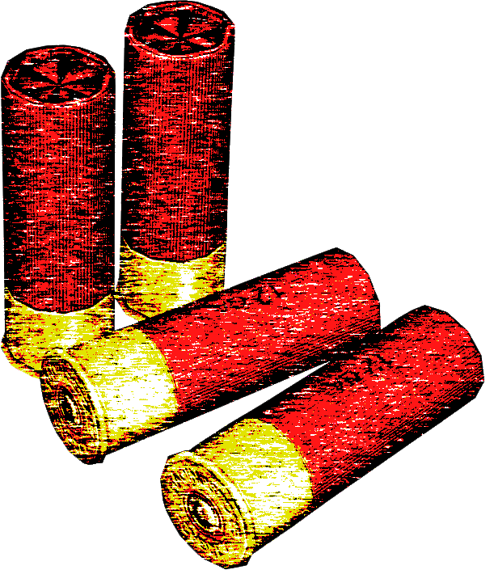
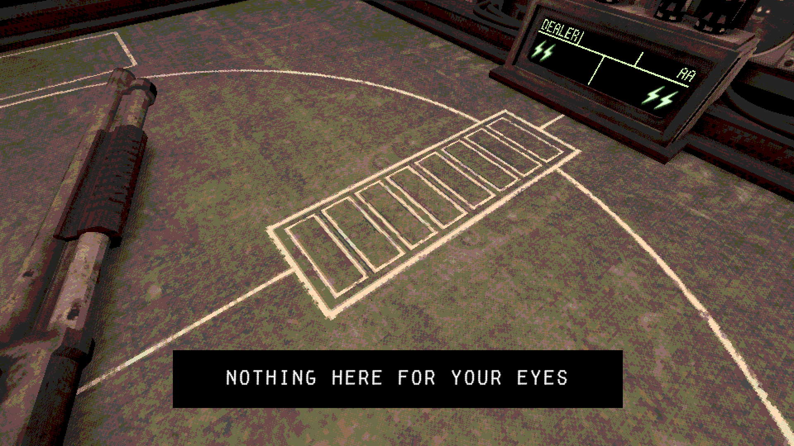
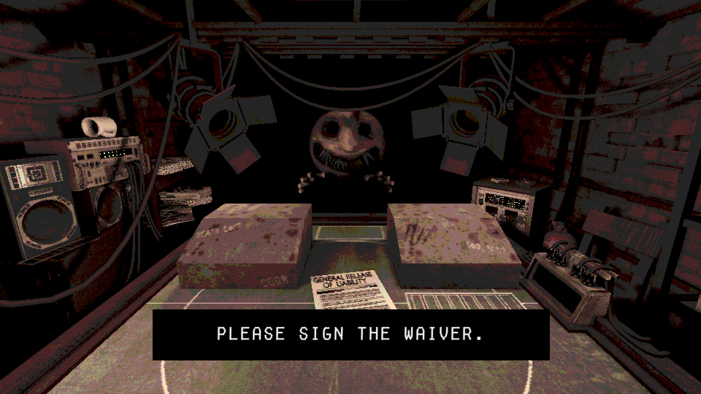
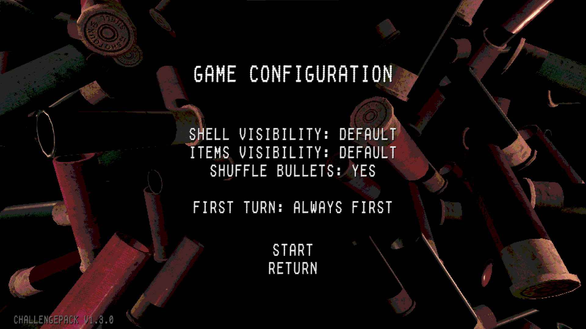
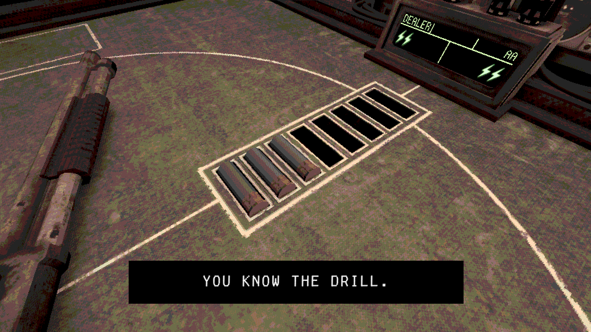

 

   

   <h3 align="center">Challenge Pack - Mod for Buckshot Roulette</h3>

   

    Now I keep even more secrets. <b>Shall we play?</b>
   

---

> ⚠⚠ Add Steam Version Support! ⚠⚠

  

 

Play a real game with the <b>devil</b>! No mercy, now game become really hard! Test your luck dancing on the edge of life and death! 

## Features

Several new game modes, which provides more hardcore gameplay

#### Shell Visibility:

 _Default_ - Bullets shown like in original game

 _Quantity_ - Only the number of bullets is known. Guess which of these bullets is loaded?

 _Hidden_ - Pure random - no information about bullets. Test your luck!

#### Items Visibility:

 _Default_ - items visible like in original game

 _Hidden_ - Dealer can keep secrets - now his items are not visible. Enjoy!

#### Shuffle Bullets:

 _Yes_ - bullets will be randomly loaded like in original game

 _No_ - Bullets will be loaded in the same order as they lay on the table

#### First turn:

 _Always First_ - player always shoot first like in original game

 _Round Robin_ - after reloading, the one who didn't get the gun last time goes

 _Random_ - after reloading, the next player is chosen randomly

## Installation

1. Download & Install AGO061 Mod Loader (https://github.com/AGO061/BuckshotRouletteModLoader)
1. Download mod from [releases](https://github.com/StarPandaBeg/ChallengePack/releases/latest) page
1. Put mod archive inside `/mods` folder (you should create it manually)
1. Configure game before it starts
1. Enjoy

## Screenshots

  
  
  

 

# License

Distributed under the MIT License.  
See `LICENSE` for more information.

# Disclaimer

This project was created from a spontaneous idea in just a few hours.. It may contain errors or inaccuracies. I would appreciate your feedback and suggestions for improvement. Thanks! 💗
